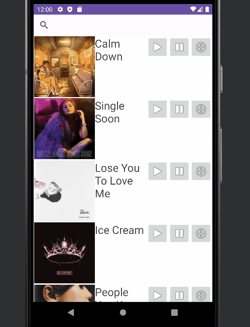

## App Demo Video

[MusicBuddy Demo (Made with ClipChamp)](https://clipchamp.com/watch/LVzIfNa7nn9)

# Milestone 1 - Music Buddy (Unit 7)

## Table of Contents

1. [Overview](#Overview)
1. [Product Spec](#Product-Spec)
1. [Wireframes](#Wireframes)

## Overview

### Description

The Music Buddy is a free, easy-to-use, mobile music companion that suggests new, upcoming, and popular music. This includes information like the song title, artist, and even the song lyrics. Stay tuned with your Music Buddy!

### App Evaluation

- **Category:** Music & Entertainment

- **Mobile:** This easy-to-use app quickly provides information about songs including the artist, song name, and the lyrics to the song. The user can also play a brief preview of the song within the app and view a list of trending music real-time.

- **Story:** The application would be popular among any audience that seeks further information about a song they may know, or may have heard. It will assist in finding lyrics to songs rather than having to google them. It will also suggest popular music in different categories.

- **Market:** The app is intended to reach individuals who enjoy listening to music. Music enthusiasts can reference the app for quick information about songs, albums, lyrics, and other relevant facts.

- **Habit:** The average users will only be able to consume the app to view information about music.

- **Scope:** The app seems simple if we use an API to pull both the song information and the song lyrics and provide the information to the user. The only challenge would be finding a reliable, free, API that is easy to use when developing the app.

## Product Spec

### 1. User Features

**Features**

- [x] Display Trending music and genres.
- [x] User is able to search for a specific artist.
- [x] App plays a small portion of the song
      
### 2. Screen Archetypes

- [Home Screen]
  - Users would see a list of popular music 
- [Search]
  - Users can search for music
    
### 3. Navigation

**Tab Navigation** (Tab to Screen)

- [x] [Home Screen] 
- [x] [Search Screen]

**Flow Navigation** (Screen to Screen)

- [Home Screen]
  - When the user loads the app they are shown a list of songs from popular artists.
 
- [Search Screen]
  - When a user searches they are directed to a Search Screen
 
    
## Wireframes (concepts)

# Milestone 2 - Build Sprint 1 (Unit 8)

## GitHub Project board

## Issue cards
  **Screenshot is of both current and future issues.**
 

## Issues worked on this sprint

- List the issues you completed this sprint

# Milestone 3 - Build Sprint 2 (Unit 9)

## GitHub Project board

