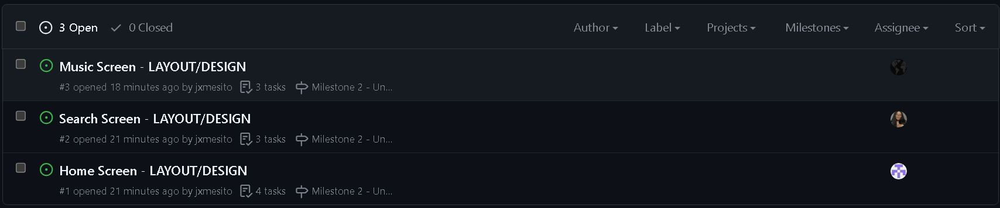

# Milestone 1 - Music Buddy (Unit 7)

## Table of Contents

1. [Overview](#Overview)
1. [Product Spec](#Product-Spec)
1. [Wireframes](#Wireframes)

## Overview

### Description

The Music Buddy is a free, easy-to-use, mobile music companion that suggests new, upcoming, and popular music. This includes information like the song title, artist, and even the song lyrics. Stay tuned with your Music Buddy!

### App Evaluation

- **Category:** Music & Entertainment

- **Mobile:** This easy-to-use app quickly provides information about songs including the artist, song name, and the lyrics to the song. The user can also play a brief preview of the song within the app and view a list of trending music real-time.

- **Story:** The application would be popular among any audience that seeks further information about a song they may know, or may have heard. It will assist in finding lyrics to songs rather than having to google them. It will also suggest popular music in different categories.

- **Market:** The app is intended to reach individuals who enjoy listening to music. Music enthusiasts can reference the app for quick information about songs, albums, lyrics, and other relevant facts.

- **Habit:** The average users will only be able to consume the app to view information about music.

- **Scope:** The app seems simple if we use an API to pull both the song information and the song lyrics and provide the information to the user. The only challenge would be finding a reliable, free, API that is easy to use when developing the app.

## Product Spec

### 1. User Features (Required and Optional)

**Required Features**

- [ ] Display Trending music and genres.
- [ ] User is able to search for a specific song. 
- [ ] App displays information about that song such as: lyrics, artist, song name.

**Optional Features**

1. User is able to save songs to a personal library.
2. User is able to view the album/song cover.
3. Preview the song.

### 2. Screen Archetypes

- [Home Screen]
  - Users would see a list of popular music 
  - Users can see different genres of music 
- [Search]
  - Users can search for music 
- [Music Info Screen]
  - Users can see artist name, song title, album
- [Favorites Page]
  - Users can view their saved music 
  

### 3. Navigation

**Tab Navigation** (Tab to Screen)

- [x] [Home Screen]
- [x] [Search Screen]
- [x] [Favorites Page]

**Flow Navigation** (Screen to Screen)

- [Home Screen]
  - When the user selects an item on the Music Feed, they are directed to the corresponding Music Info Screen
 
- [Search Screen]
  - When a user selects an option in the search screen, they are directed to a Music Info Screen
  
- [Music Screen]
  - Plus button allows user to add the song to their favorites.
 
    
## Wireframes

 

 

### [BONUS] Digital Wireframes & Mockups

### [BONUS] Interactive Prototype

 

# Milestone 2 - Build Sprint 1 (Unit 8)

## GitHub Project board

[Add screenshot of your Project Board with three milestones visible in
this section]

## Issue cards
  **Screenshot is of both current and future issues.**
- [Add screenshot of your Project Board with the issues that you're working on in the **NEXT sprint**. It should include issues for next unit with assigned owners.] 

## Issues worked on this sprint

- List the issues you completed this sprint
- [Add giphy that shows current build progress for Milestone 2. Note: We will be looking for progression of work between Milestone 2 and 3. Make sure your giphys are not duplicated and clearly show the change from Sprint 1 to 2.]

 

# Milestone 3 - Build Sprint 2 (Unit 9)

## GitHub Project board

[Add screenshot of your Project Board with the updated status of issues for Milestone 3. Note that these should include the updated issues you worked on for this sprint and not be a duplicate of Milestone 2 Project board.] 

## Completed user stories

- List the completed user stories from this unit
- List any pending user stories / any user stories you decided to cut
from the original requirements

[Add video/gif of your current application that shows build progress]

## App Demo Video

- Embed the YouTube/Vimeo link of your Completed Demo Day prep video
